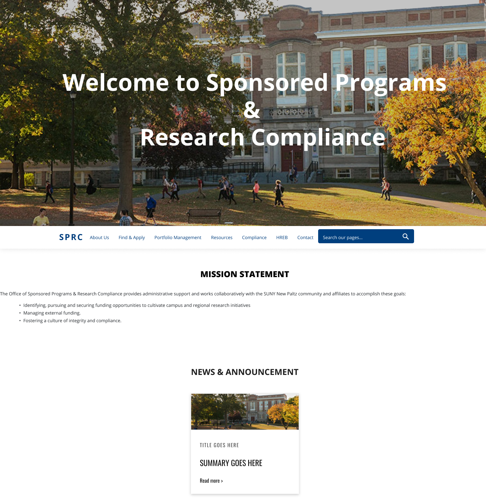

# Sponsored Programs & Research Compliance

This repository documents my work done for the Office of Sponsored Programs & Research Compliance.

1.  **Personal Information:**

        Name: Yitzhak Alvarez
        Major: Computer Science
        Email: alvarezy3@newpaltz.edu

2.  **Supervisors:**  
    <a href="mailto:merrillr@newpaltz.edu">Roseann Merrill</a>  
    <a href="mailto:hoseltoc@newpaltz.edu">Catherine Hoselton</a>
3.  **Start Date:** October 2020
4.  **End Date:** August 2021

# Project Description

This web project was done for the Office of Sponsored Programs & Research Compliance. I was tasked with revamping and designing the website.

# Links

- <a href="https://yitzhakalvarez.com/SPRC-WebsiteRevamp/">SPRC website testing</a>
- <a href="https://www.figma.com/proto/M304oso7qZPKhtnjQU73Jt/SPRC-Landing-Page-Mockup?page-id=0%3A1&node-id=5%3A2&viewport=181%2C-55%2C0.04520059749484062&scaling=min-zoom&starting-point-node-id=5%3A2">Figma website protoype</a>

# Tech

Application:

- HTML – Used to structure the web pages.
- CSS – Used to style the HTML.
- JavaScript – Used to make the pages interactive.
- Bootstrap - Used as a front-end framework to make the web pages faster and easier.
- Figma - Used to design the user interface of the website.
- TerminalFour - Used the school's CMS to deploy the website.

# Design

## Landing Pages

_Before_

_After_

# Mockups

## Sponsored Programs & Research Compliance

</img>
</img>
</img>
</img>
</img>
</img>
</img>
</img>
